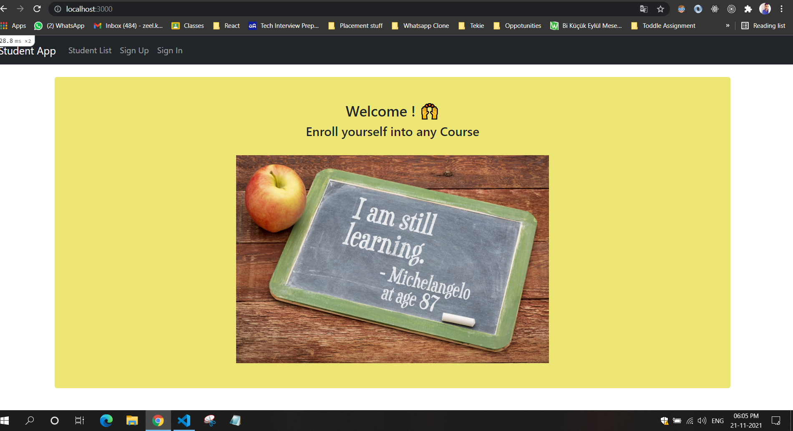
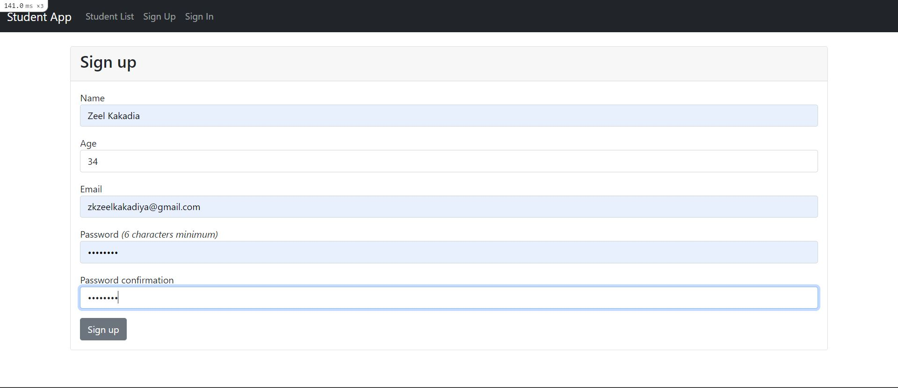
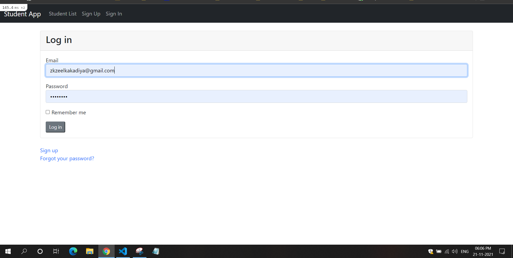
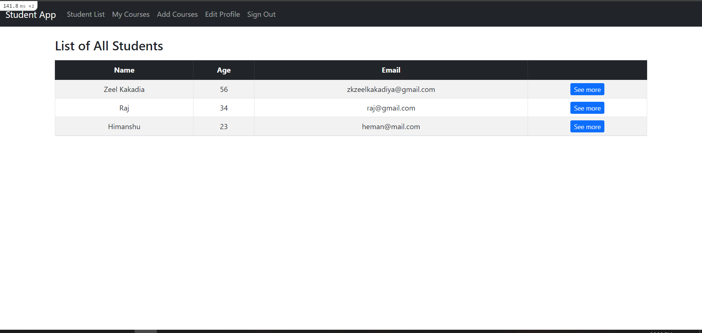
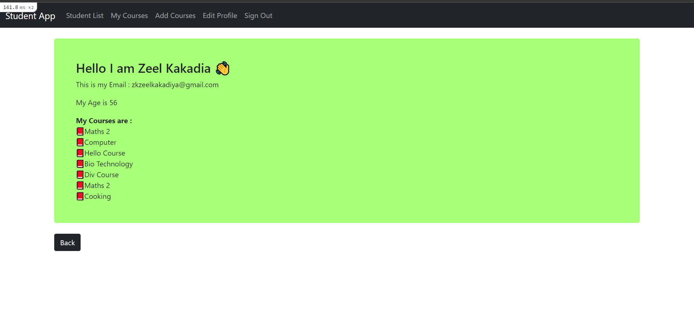
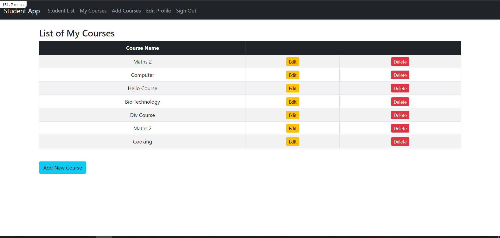
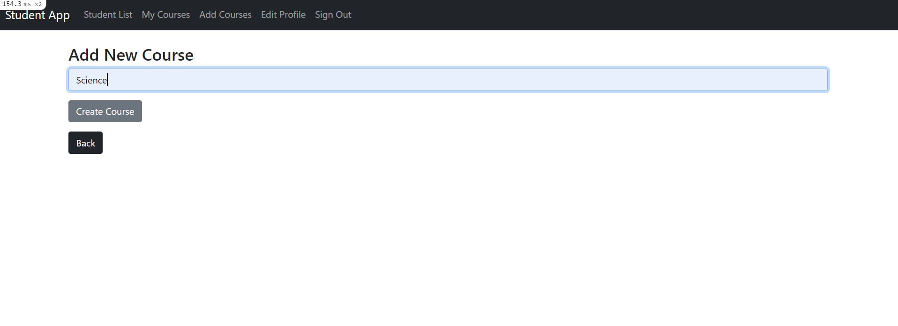
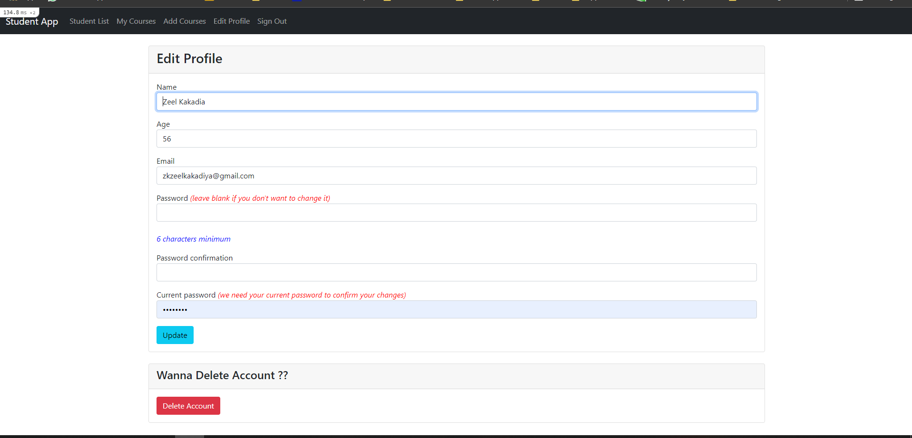

# Course App

This is Ruby On Rails CRUD App for creating registration of course by students. 

Reference : [Creating a Basic Rails CRUD App by Reinald Reynoso](https://levelup.gitconnected.com/creating-a-basic-rails-crud-app-8720a53f0158)

## Following changes are done by me :

- Improved UI little bit
- Student can Login, Sign Up and Log out
- Only Logged In student can modify their own courses
- If the student is not Logged In, then he/she can view details of other available students.
- Reset Password option
- Message pop up when student sign in or log out

